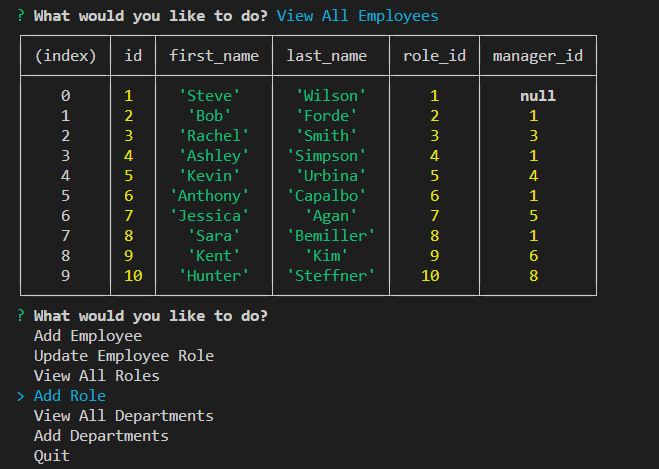

# Employee Tracker

## Table of Contents

- [Description](#description)
- [Installation](#installation)
- [Usage](#usage)
- [Video](#video)
- [Contribution](#contribution)
- [Contact](#contact)

## Description

This program was made with Node.js and MySQL to serve as a command-line powered employee database. You can use this to view all departments, roles, and employees, and also add to them as needed.

## Installation

This program requires Node.js and NPM. Once these are installed, please run:

```
npm init -y

npm i
```

## Usage

For usage instructions, please do the following:

Enter node server.js into your terminal. You will then be prompted with a list of options for how you would like to interact with the database. If you select to view all employees, roles, or departments, a list of category you have selected will populate the terminal showing everything entered in the database for that category. Employees contain an ID, first name, last name, role ID, and manager ID fields. Roles contain the ID, title, salary, and department ID fields. Departments contain the ID and name fields. If you choose to add to any of these databases, it will ask a series of questions and then run the MySQL command to add the new row to the database.

## Video

[Link to instructional video](https://huntersteffner.github.io/Employee-Tracker/)

## Card Image Credits



## Contribution

You may contact me directly, and then fork the project. Anyone can contribute, but please provide credit to the original work.

## Questions

Feel free to reach out to me directly if you have any questions or concerns. You can reach me via email, or check out my github profile below.

Email: huntersteffner@gmail.com

GitHub: [huntersteffner](https://github.com/huntersteffner/)

## Future developments

Add validation functionality to ensure that input is in the expected format.
